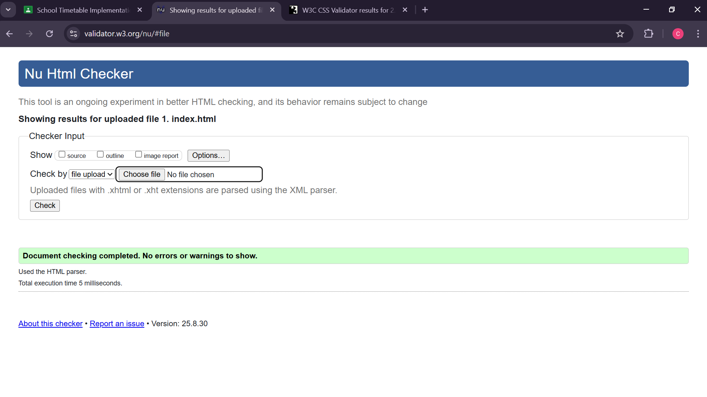
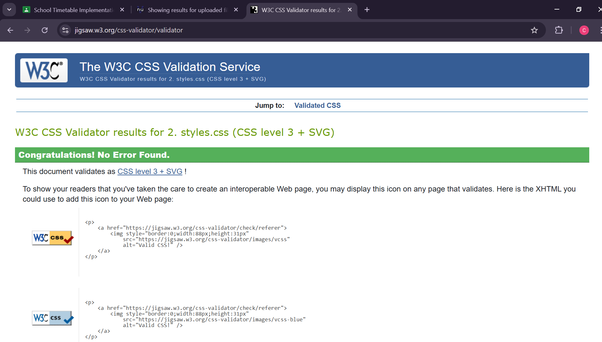
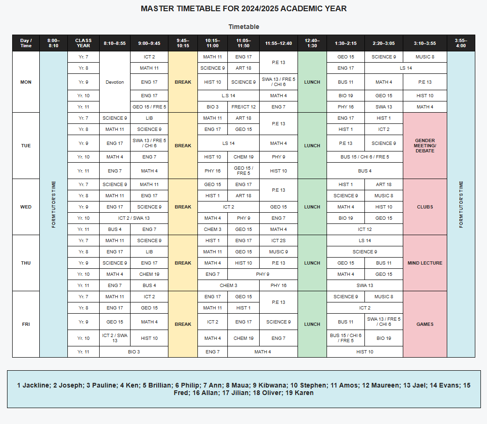

<body>
<main>
<title>Carlos_Kimuyu</title>
<section>
<h2><strong><i>📌 Project Description</i></strong></h2>

This project is a school master timetable webpage for the 2024/2025 academic year.
<ul>

<li>It is built using HTML5 for structure and CSS3 for styling.</li>

<li>The timetable organizes lessons by days of the week (Monday–Friday), class years (Yr. 7–11), and time slots.</li>

<li>Special sessions such as breaks, lunch, devotion, clubs, and meetings are highlighted with distinct background colors for quick identification.</li>

<li>A footer lists the teachers associated with different subjects.</li>

<li>The design uses a responsive layout: the table is wrapped in a scrollable container (.table-wrap) so it remains usable on smaller screens.</li>

<li>✅ The project has passed validation checks using the W3C Markup Validation Service (HTML) and the W3C CSS Validation Service (CSS), with no errors or warnings present in the final submission.</li>
 
</ul>

  

</section>

<section>
<h2><strong><i>♿ Accessibility Considerations</i></strong></h2>

The project includes several features aimed at accessibility:
<ol>
<li>Semantic HTML Structure</li>
<ul>
<li>Proper use of header, section and footer helps screen readers navigate.</li>

<li>Table headers (th) use scope="col" and scope="row" attributes to define relationships, aiding assistive technology in interpreting the table.</li>
</ul>

<li>ARIA Attributes</li>
<ul>
<li>The timetable wrapper uses role="region" and aria-label="Master timetable table" so screen readers can identify it as an important landmark</li>.

<li>Decorative duplicate cells (like repeated “FORM TUTOR’S TIME”) are hidden from screen readers with aria-hidden="true".</li>
</ul>

<li>Color Coding with Meaning</li>
<ul>
<li>Special time slots (e.g., Break, Lunch, Special Sessions, Form Tutor Time) use distinct background colors for quick recognition.</li>

<li>However, accessibility could be improved by ensuring textual indicators (like labels or icons) accompany the colors, since color alone may not be distinguishable for color-blind users.</li>
</ul>

<li>Responsive Design</li>
<ul>
<li>The <u><i>.table-wrap</i></u> provides horizontal scrolling to prevent content from breaking on smaller devices, making the timetable usable on mobile.</li>
</ul>
<li>Text Readability</li>
<ul>
<li>Font sizes are kept moderate (0.82rem–1.4rem).</li>

<li>Good contrast is maintained in the table header (white text on dark background).</li>

<li>Some cells with light backgrounds (like yellow for break) still have black text, which preserves readability.</li>
</ol>
<footer>Master timetable for the academic year 2024/2025 showing days of the week, class years and subjects.</footer>
</main>
</body>

</section>